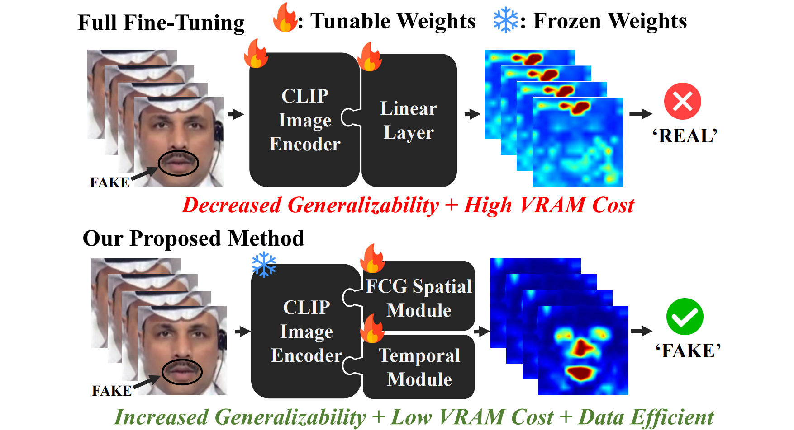

<p align="center">
  <h1 align="center">[CVPR'25] Towards More General Video-based Deepfake Detection through Facial Feature Guided Adaptation for Foundation Model (DFD-FCG)</h1>

  <p align="center">
    <a href="https://github.com/ODD2"><strong>Yue-Hua Han</strong></a>
    <sup>1,3,4</sup>
    &nbsp;&nbsp;
    <a href="https://github.com/Teddy12155555"><strong>Tai-Ming Huang</strong></a>
    <sup>1,3,4</sup>
    &nbsp;&nbsp;
    <a href="https://scholar.google.com/citations?user=nnzQtDAAAAAJ&hl=zh-TW"><strong>Kai-Lung Hua</strong></a>
    <sup>2,4</sup>
    &nbsp;&nbsp;
    <a href="https://scholar.google.com.au/citations?user=3x9KITUAAAAJ&hl=en"><strong> Jun-Cheng Chen</strong></a>
    <sup>1</sup>
    <br>
    <!-- <sup>1</sup>Academia Sinica&nbsp;
    <sup>2</sup>Microsoft&nbsp;
    <sup>3</sup>National Taiwan University&nbsp;
    <br>
    <sup>4</sup>National Taiwan University of Science and Technology&nbsp; -->
    <sup>1</sup>Academia Sinica,</span>&nbsp;
    <sup>2</sup>Microsoft,</span>&nbsp;
    <sup>3</sup>National Taiwan University,</span>&nbsp;
    <br>
    <sup>4</sup>National Taiwan University of Science and Technology</span>&nbsp;
    <br>
    <a href='https://arxiv.org/abs/2404.05583'></a>&nbsp;
    
  </p>
</p>

## 🥇Abstract
<div style="text-align: justify">  
Generative models have enabled the creation of highly realistic facial-synthetic images, raising significant concerns due to their potential for misuse. Despite rapid advancements in Deepfake detection research, few works have explored harnessing foundation models to enhance generalizability toward unseen forgery samples. To address this challenge, we propose a novel side-network-based decoder that extracts spatial and temporal cues using the CLIP image encoder for generalized video-based Deepfake detection. Additionally, we introduce Facial Component Guidance (FCG) to enhance spatial learning generalizability by encouraging the model to focus on key facial regions. By leveraging the generic features of a vision-language foundation model, our approach demonstrates promising generalizability on challenging Deepfake datasets while also exhibiting superiority in training data efficiency, parameter efficiency, and model robustness.
</div>

## 📝TODOs
  - [ ] Model Weights + Inference Code
  - [ ] Training Code
  - [ ] HeyGen Evaluation Dataset

## 🔗BibTeX
If you find our efforts helpful, please cite our paper and leave a star for further updates!
```bibtex
@inproceedings{cvpr25_dfd_fcg,
      title={Towards More General Video-based Deepfake Detection through Facial Component Guided Adaptation for Foundation Model},
      author={Yue-Hua Han, Tai-Ming Huang, Kai-Lung Hua, Jun-Cheng Chen},
      booktitle={Proceedings of the Conference on Computer Vision and Pattern Recognition (CVPR)},
      year={2025}
}
```


## 📭 Contact
If you have any comments or questions, feel free to contact us!
